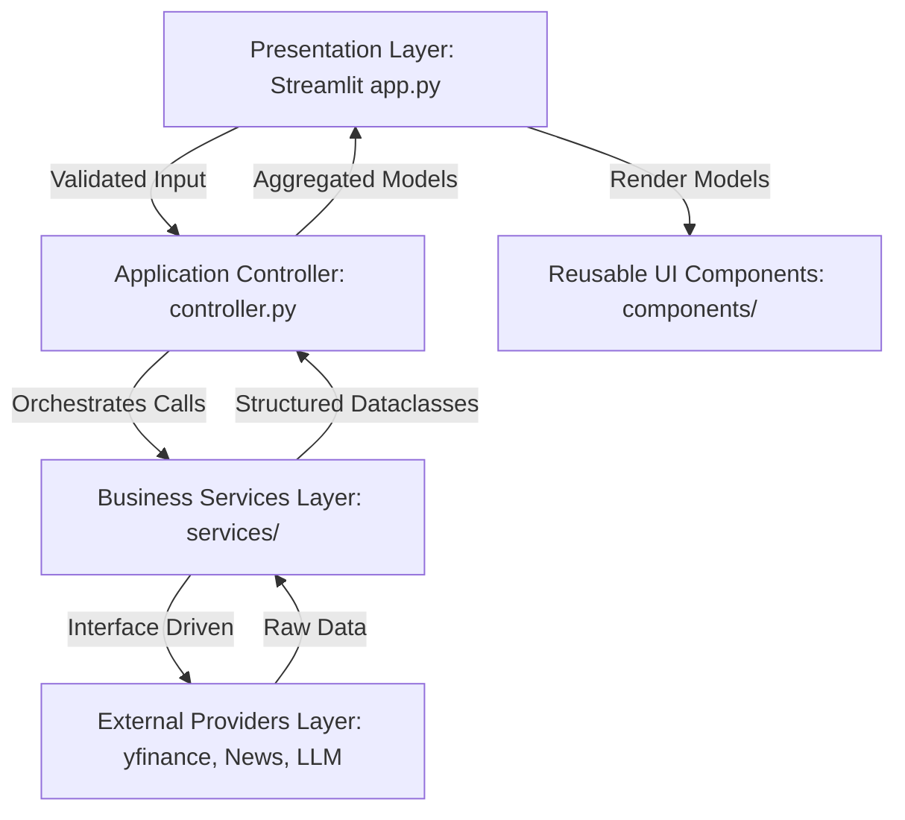

# FinSight Software Architecture Blueprint

This document defines the software architecture, design principles, module interfaces, and data boundaries governing the FinSight application.

---

## 1. Architectural Layers & Structure

FinSight is designed using a **Clean Architecture / N-Tier Architecture** pattern adapted for Streamlit. The application code is separated into distinct responsibility layers.



### Layer Definitions

1. **Presentation Layer (`app.py`, `pages/`)**:
   - Collects user selections (e.g. stock tickers).
   - Validates basic input formats (e.g. check ticker length and characters).
   - Draws layout frames and page grids.
   - Delegates operations to the **Application Controller** and renders the returning data using **UI Components**.
   - Contains NO calculations or external service API calls.

2. **Application Controller (`services/controller.py`)**:
   - Orchestrates the sequence of business operations required to satisfy a user request.
   - Injectable with abstract business services.
   - Catches service exceptions, handles fallbacks, and packages results into a unified structure.

3. **Business Services Layer (`services/interfaces.py`, future implementations)**:
   - Contains core business logic (e.g. parsing ratios, categorizing risk scores).
   - Communicates with the data layers via **Provider Interfaces**.
   - Converts raw dictionaries into structured **Data Models**.
   - Isolated from Streamlit rendering libraries.

4. **External Provider Layer (`services/providers.py`, future implementations)**:
   - Houses third-party client wrappers (e.g. `yfinance`, REST requests, LLM API clients).
   - Responsible for raw payload validation, request construction, API error handling, and timeout retries.

5. **Data Models Layer (`models/`)**:
   - Strongly-typed `dataclasses` representing domain-level data structures (e.g. `CompanyInfo`, `FinancialMetrics`, `SentimentResult`, etc.).
   - Standardizes communication data formats between all execution layers.

6. **UI Component Layer (`components/`)**:
   - Houses modular rendering functions (e.g. `render_company_profile_card`, `render_sentiment_card`).
   - Accepts dataclass instances as arguments.
   - Keeps formatting and HTML/CSS overrides consistent across all dashboard pages.

---

## 2. Module Responsibilities

| Package | File / Module | Responsibility |
| :--- | :--- | :--- |
| **`config/`** | `settings.py` | Load `.env` values, validate formats, expose configurations singleton. |
| **`core/`** | `logger.py` | Configure rotating file & console output logging. |
| **`core/`** | `exceptions.py` | Define custom domain exceptions. |
| **`core/`** | `constants.py` | Centralize theme colors, chart layouts, NLP boundaries, and stock listings. |
| **`models/`** | `company.py` | Store company profile structure. |
| **`models/`** | `financial.py` | Store stock metrics and historical prices structure. |
| **`models/`** | `news.py` | Store news item details and sentiment summaries. |
| **`models/`** | `risk.py` | Store scorecards and advisory records. |
| **`services/`**| `interfaces.py` | Abstract definitions of business logic operations. |
| **`services/`**| `providers.py` | Abstract definitions of external API handlers. |
| **`services/`**| `controller.py` | Aggregate multi-service analysis responses. |
| **`components/`**| `cards.py` | Reusable layout functions for widgets and summaries. |
| **`utils/`** | `helpers.py` | General currency, numeric, and date string parsing. |

---

## 3. Module Dependency Rules

To keep the application highly decoupled and ensure components can be modified or tested independently, the following boundary rules must be followed:

1. **No UI Code in Services**: Business services and external providers must never import `streamlit` or interact with the screen buffer.
2. **Dependency Inversion**: Services and controllers depend on abstract interfaces (from `interfaces.py` and `providers.py`), not concrete classes.
3. **Model Decoupling**: Models are simple data objects containing no business logic or API code.
4. **Utility Isolation**: Shared utilities in `utils/` must remain domain-neutral. They must not import from business services or configuration settings.

---

## 4. Request Lifecycle and Data Flow

```text
[User Action]
      │   Select Ticker (e.g. "AAPL")
      ▼
┌──────────────┐
│    app.py    │ ── 1. Validate basic input (non-empty string, alphabetic)
└──────────────┘
      │
      │   2. call controller.analyze_ticker("AAPL")
      ▼
┌─────────────────────────┐
│  ApplicationController  │ ── 3. Initialize aggregated result dict
└─────────────────────────┘
      │
      ├── 4. Call company_service.get_profile("AAPL")
      │      └── fetch_company_info() ──► [External API] ──► Parse to CompanyInfo
      │
      ├── 5. Call financial_service.get_financial_metrics("AAPL")
      │      └── fetch_financial_statements() ──► [External API] ──► Parse to FinancialMetrics
      │
      ├── 6. Call news_service.get_recent_news("AAPL")
      │      └── fetch_news() ──► [News API] ──► Parse to List[NewsArticle]
      │
      ├── 7. Call sentiment_service.analyze_sentiment(articles)
      │      └── Compute NLP Polarity ──► Aggregate to SentimentResult
      │
      ├── 8. Call risk_service.assess_risk(metrics, sentiment)
      │      └── Evaluate debt ratios & sentiment bias ──► Compute RiskAssessment
      │
      ├── 9. Call ai_service.generate_advisory_summary(profile, metrics, sentiment, risk)
      │      └── Prompt LLM ──► Parse response to AISummary
      │
      ▼
┌─────────────────────────┐
│  ApplicationController  │ ── 10. Return unified aggregation dictionary
└─────────────────────────┘
      │
      │   11. Pass models to UI components
      ▼
┌─────────────────────────┐
│    components/cards.py  │ ── 12. Render styled glassmorphic widgets in app.py
└─────────────────────────┘
```

---

## 5. Error Propagation Policy

Errors are managed consistently at all levels to prevent application crashes:

- **Provider Level**: Catches raw API errors (connection timeouts, rate limits, invalid keys) and throws custom core exceptions (e.g. `DataRetrievalError`, `ServiceError`).
- **Service Level**: Encapsulates processing faults. If a service experiences an error, it logs the exception trace and raises it back to the controller.
- **Controller Level**: Catches all exceptions. Critical failures (such as missing basic company metadata) halt execution. Non-critical failures (such as news or sentiment analysis failure) are logged, appended to a list of dashboard warning messages, and the controller returns partial data so the user can still see financial charts and metrics.
- **Presentation Level**: Displays warning/error messages using Streamlit's `st.warning` or `st.error` notifications instead of throwing unhandled stack traces.
