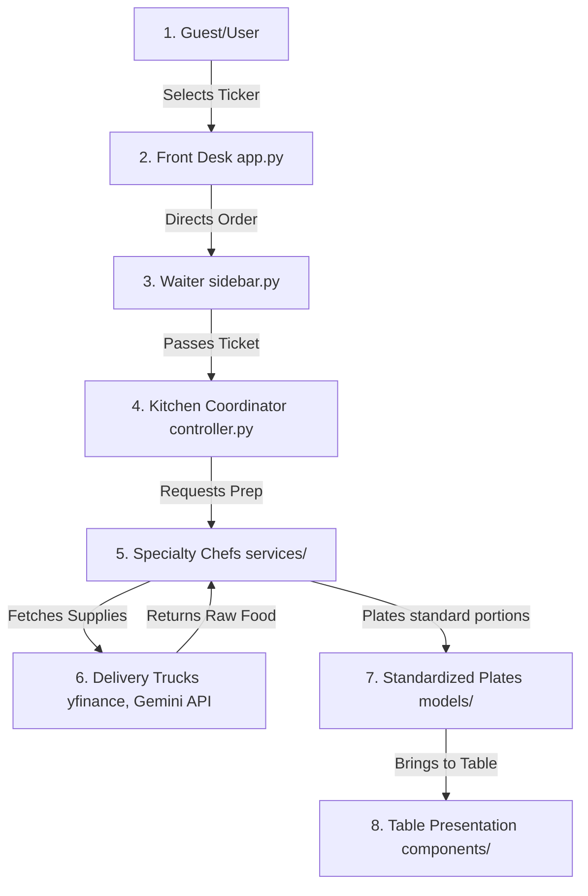

# FinSight — Corporate Financial Intelligence Platform Complete Code Guide

This document is a comprehensive guide to the **FinSight** codebase. It is written in simple, non-programmer language to help you understand the purpose, logic, and structure of every file in the project, so you can easily explain it to a professor or tutor.

---

## 1. High-Level Architecture: The Restaurant Analogy

Before looking at individual files, let's understand how the software is organized. FinSight uses a **Clean / N-Tier Architecture**. To understand what this means, imagine a **busy fine-dining restaurant**:



1. **The Diner (The User)**: Chooses a stock ticker (like `AAPL` for Apple or `MSFT` for Microsoft) and requests to see their financial statistics.
2. **The Front Desk & Table Layout (`app.py` & `pages/`)**: Arranges the seating and pages. It makes sure that the menu (tabs) looks beautiful and has the right sections (Price Chart, Financial Ratios, Risk Assessment, News & Sentiment, AI Summary).
3. **The Waiter (`components/sidebar.py`)**: Takes your order (the stock ticker) and ensures it is a valid name before walking it over to the kitchen.
4. **The Kitchen Coordinator (`services/controller.py`)**: Manages the timing. They receive the order, and call out instructions to the different chefs in order: "First, fetch company info. Then, calculate ratios. Next, look at the news. Finally, evaluate the risk score and ask the AI advisor to write a summary." If one chef drops a plate, the coordinator ensures the rest of the meal is still served.
5. **Specialty Chefs (`services/`)**: The individual programmers/services responsible for specific jobs:
   - **The Financial Chef (`services/finance/`)**: Calculates math scores (like Return on Equity).
   - **The News Analyst Chef (`services/news/`)**: Reads news articles and decides if they sound happy (positive) or worried (negative).
   - **The AI Assistant Chef (`services/ai/`)**: Compiles all notes and sends them to Google Gemini to write a summary paragraph.
6. **Delivery Trucks (`yfinance` & `Google Gemini API`)**: External suppliers. They bring raw data (stock prices, recent news articles, raw text from language models) to the back door of the kitchen.
7. **The Plates (`models/`)**: Pre-shaped, standardized plates (dataclasses). Instead of passing raw food in chaotic bags, the kitchen ensures that company profiles always fit on a "Profile Plate" and financial metrics always fit on a "Metrics Plate."
8. **The Table Presentation (`components/`)**: Visual displays (glassmorphism cards and charts) that turn plated data into readable graphics for the diner to enjoy.

---

## 2. Directory-by-Directory breakdown

Here is the explanation for **every single file** in the project, divided by directory.

---

### Root Directory (Core Settings and Entry Point)

These files reside in the main folder and control the startup, configuration, and overview of the application.

#### 1. [app.py](file:///home/computador/Desktop/App_dev/Fameeda/FinSight/app.py)
* **Analogy**: The Hostess / Restaurant Entrance.
* **Why it was used**: To serve as the main entrance (entry point) of the application.
* **For what & How it was used**: It sets up Streamlit's web browser tab title, inserts a custom logo, hides default Streamlit headers, and registers the sub-pages.
* **Where it is used**: This is the first file executed when running `streamlit run app.py`.
* **Logic it holds**: It sets up the page routing by defining which script (e.g. `pages/dashboard.py`, `pages/1_Price_Chart.py`) corresponds to which menu option, and runs the custom sidebar.

#### 2. [requirements.txt](file:///home/computador/Desktop/App_dev/Fameeda/FinSight/requirements.txt)
* **Analogy**: The Grocery Shopping List.
* **Why it was used**: To tell Python exactly which external libraries need to be installed for the app to function.
* **For what & How it was used**: Lists libraries like `streamlit` (UI), `yfinance` (stock market data), `textblob` (NLP sentiment analysis), `nltk` (text preprocessing), and `requests` (sending internet messages).
* **Where it is used**: Used by package managers like `pip` to install dependencies.
* **Logic it holds**: Contains no code, only a list of library names and version restrictions.

#### 3. [README.md](file:///home/computador/Desktop/App_dev/Fameeda/FinSight/README.md)
* **Analogy**: The Owner's Manual.
* **Why it was used**: To guide human developers on how to install, configure, and launch the application.
* **For what & How it was used**: Written in markdown text to detail step-by-step commands, environment settings, and features.
* **Where it is used**: Read by developers in text editors or on Github.
* **Logic it holds**: Static text instructions; holds no programmatic logic.

#### 4. [ARCHITECTURE.md](file:///home/computador/Desktop/App_dev/Fameeda/FinSight/ARCHITECTURE.md)
* **Analogy**: The Architectural Blueprints.
* **Why it was used**: To document the code structure, dependency boundaries, data flow diagrams, and error handling philosophies.
* **For what & How it was used**: Explains to other engineers why the code is separated into layers (Models, Services, Components) and how data flows through them.
* **Where it is used**: Read by developers to maintain clean code patterns.
* **Logic it holds**: Document details; holds no execution logic.

#### 5. [.env](file:///home/computador/Desktop/App_dev/Fameeda/FinSight/.env)
* **Analogy**: The Private Safe.
* **Why it was used**: To store confidential API keys and configuration parameters that shouldn't be shared publicly on GitHub.
* **For what & How it was used**: Contains variables like `GEMINI_API_KEY` and `GEMINI_MODEL`.
* **Where it is used**: Loaded automatically at startup by the configuration module.
* **Logic it holds**: Key-value pairs (text configurations).

#### 6. [.gitignore](file:///home/computador/Desktop/App_dev/Fameeda/FinSight/.gitignore)
* **Analogy**: The Trash Shredder Filter.
* **Why it was used**: Tells Git (the version control system) which files are private or temporary and should never be uploaded online.
* **For what & How it was used**: Lists files like `.env`, local database folders, temporary logs, and compiled Python files (`__pycache__`).
* **Where it is used**: Checked automatically by Git before uploading changes.
* **Logic it holds**: Text list of file patterns to ignore.

---

### `config/` Directory (Global Settings)

This folder manages how environment files are loaded and validated.

#### 7. [config/\_\_init\_\_.py](file:///home/computador/Desktop/App_dev/Fameeda/FinSight/config/__init__.py)
* **Analogy**: The Config Keyring.
* **Why it was used**: To package the configuration module nicely so other files can just import `settings` directly.
* **Logic it holds**: It imports the `Settings` class and instantiates it once, creating a "Singleton" (a single shared settings object).

#### 8. [config/settings.py](file:///home/computador/Desktop/App_dev/Fameeda/FinSight/config/settings.py)
* **Analogy**: The Building Inspector.
* **Why it was used**: Loads variables from `.env` and validates that they are in the correct format before launching the application.
* **Where it is used**: Imported by any service that needs configuration values (such as logging levels or the Gemini API key).
* **Logic it holds**: It checks if environment variables like `DEBUG` are true/false, determines the application's root directory, and exposes them as safe Python variables.

---

### `core/` Directory (Core Infrastructure)

This folder houses global settings, constants, and logging handlers that are used across all modules.

#### 9. [core/\_\_init\_\_.py](file:///home/computador/Desktop/App_dev/Fameeda/FinSight/core/__init__.py)
* **Analogy**: The Core Manager.
* **Why it was used**: Makes the `core` folder a package and exposes logging functions to the rest of the application.
* **Logic it holds**: Simply imports and exposes the logger initialization functions.

#### 10. [core/constants.py](file:///home/computador/Desktop/App_dev/Fameeda/FinSight/core/constants.py)
* **Analogy**: The Standard Rule Book.
* **Why it was used**: To centralize parameters that never change during runtime (like theme colors, NLP boundaries, and stock listings).
* **Where it is used**: Imported by UI charts to keep colors matching, and by services to check thresholds.
* **Logic it holds**: Defines static variables: `APP_TITLE = "FinSight"`, chart styling parameters, and sentiment classification cutoffs.

#### 11. [core/exceptions.py](file:///home/computador/Desktop/App_dev/Fameeda/FinSight/core/exceptions.py)
* **Analogy**: The Custom Alarm Bells.
* **Why it was used**: To define specialized types of errors so the application can identify *exactly* what went wrong (e.g., did the internet drop, or did the user type an invalid name?).
* **Logic it holds**: Declares custom Python exception classes:
  - `FinSightException` (Base error)
  - `InvalidInputError` (User typed something bad)
  - `DataRetrievalError` (External API returned nothing)
  - `ServiceError` (External API crashed or timed out)

#### 12. [core/logger.py](file:///home/computador/Desktop/App_dev/Fameeda/FinSight/core/logger.py)
* **Analogy**: The Security Camera Logbook.
* **Why it was used**: Keeps a written history of what the application was doing at every millisecond so developers can debug issues.
* **Where it is used**: Writes outputs to the console and to the rotating log file at `logs/finsight.log`.
* **Logic it holds**: Sets up log rotation rules (so log files don't grow too large and crash the hard drive) and formats lines with timestamps and module names.

---

### `models/` Directory (Standardized Plates / Data Forms)

These files act as the "standard blueprints" or "forms" of the application. They contain no calculations or business logic; they only define *how data should look* when moving between components.

#### 13. [models/\_\_init\_\_.py](file:///home/computador/Desktop/App_dev/Fameeda/FinSight/models/__init__.py)
* **Analogy**: The Form Rack.
* **Why it was used**: Bundles all the models together to allow clean imports in other modules.
* **Logic it holds**: Simply imports and exposes all dataclasses.

#### 14. [models/company.py](file:///home/computador/Desktop/App_dev/Fameeda/FinSight/models/company.py)
* **Analogy**: Corporate ID Card.
* **Why it was used**: Holds basic identifying information about a searched stock ticker.
* **Logic it holds**: Defines a `CompanyInfo` structure with: `ticker`, `name`, `sector`, `industry`, `summary`, and `website`.

#### 15. [models/financial.py](file:///home/computador/Desktop/App_dev/Fameeda/FinSight/models/financial.py)
* **Analogy**: The Bank Balance Sheet Form.
* **Why it was used**: Standardizes financial statement numbers and price lists.
* **Logic it holds**: Defines:
  - `FinancialMetrics`: Holds market capitalization, EBITDA, debt levels, cash, revenue, and gross profit.
  - `HistoricalPrice`: Holds a single day's stock price details (date, open, high, low, close, volume).

#### 16. [models/news.py](file:///home/computador/Desktop/App_dev/Fameeda/FinSight/models/news.py)
* **Analogy**: The Newspaper Clipping Form.
* **Why it was used**: Standardizes how articles and aggregate sentiment calculations are held.
* **Logic it holds**: Defines:
  - `NewsArticle`: Title, summary, publish date, source link, sentiment score, and label.
  - `SentimentResult`: Total article count, positive/negative count, and average score.

#### 17. [models/overview.py](file:///home/computador/Desktop/App_dev/Fameeda/FinSight/models/overview.py)
* **Analogy**: The Executive Summary Form.
* **Why it was used**: Combines corporate profiles with currency codes and capitalization numbers.
* **Logic it holds**: Defines a `CompanyOverview` structure.

#### 18. [models/ratios.py](file:///home/computador/Desktop/App_dev/Fameeda/FinSight/models/ratios.py)
* **Analogy**: Financial Performance Form.
* **Why it was used**: Standardizes financial evaluation ratios.
* **Logic it holds**: Defines `FinancialRatios` (P/E Ratio, P/B Ratio, Return on Equity, Net Profit Margin, Dividend Yield, and Earnings Per Share).

#### 19. [models/risk.py](file:///home/computador/Desktop/App_dev/Fameeda/FinSight/models/risk.py)
* **Analogy**: The Risk Scorecard and AI Briefing Forms.
* **Why it was used**: Standardizes the final risk rankings and AI-generated advisory paragraphs.
* **Logic it holds**: Defines:
  - `RiskAssessment`: holds risk score, level (Low/Moderate/High), and list of active warning factors.
  - `AISummary`: holds executive summaries, investment theses, strengths, weaknesses, and a timestamp.

---

### `services/` Directory (The Kitchen / Business Logic)

This folder contains the core logic engines that process, validate, calculate, and fetch data.

#### 20. [services/\_\_init\_\_.py](file:///home/computador/Desktop/App_dev/Fameeda/FinSight/services/__init__.py)
* **Analogy**: The Kitchen Hub.
* **Why it was used**: Imports and exposes the concrete service structures and controllers.

#### 21. [services/interfaces.py](file:///home/computador/Desktop/App_dev/Fameeda/FinSight/services/interfaces.py)
* **Analogy**: The Recipe Book Outlines.
* **Why it was used**: Defines "contracts" (Abstract Base Classes) specifying exactly which functions each service must implement. This ensures we can easily swap data providers (like yfinance for a real bank API) without breaking the app.
* **Logic it holds**: Declares interfaces like `ICompanySearchService` and `IFinancialService` with mandatory blueprints.

#### 22. [services/providers.py](file:///home/computador/Desktop/App_dev/Fameeda/FinSight/services/providers.py)
* **Analogy**: Sourced Supplier Blueprints.
* **Why it was used**: Declares abstract provider interfaces for third-party endpoints.
* **Logic it holds**: Declares interfaces for fetching raw financial data or querying raw news feeds.

#### 23. [services/controller.py](file:///home/computador/Desktop/App_dev/Fameeda/FinSight/services/controller.py)
* **Analogy**: The Head Kitchen Coordinator.
* **Why it was used**: To orchestrate all separate analytical services. It runs them in sequence, handles fallbacks, catches errors, and merges results.
* **Where it is used**: Triggered directly by the UI when a user enters a search ticker.
* **Logic it holds**:
  - `analyze_ticker(ticker)`: Runs steps 1 to 6. If non-critical services (like news or AI summary) fail, it catches the errors, appends warning messages, and returns a dashboard with partial data instead of crashing the application.

---

### `services/common/` Package (Validation and HTTP Client)

Contains helper modules that validate raw numbers and manage network connections.

#### 24. [services/common/\_\_init\_\_.py](file:///home/computador/Desktop/App_dev/Fameeda/FinSight/services/common/__init__.py)
* **Why it was used**: Exposes validators and common service utilities.

#### 25. [services/common/api_client.py](file:///home/computador/Desktop/App_dev/Fameeda/FinSight/services/common/api_client.py)
* **Analogy**: The Secure Delivery Messenger.
* **Why it was used**: Standardizes how the application connects to external websites.
* **Logic it holds**: Implements automatic connection retries (if the request fails, it waits and tries again up to 3 times), checks status codes, and translates complex network timeouts into user-friendly error alarms.

#### 26. [services/common/exceptions.py](file:///home/computador/Desktop/App_dev/Fameeda/FinSight/services/common/exceptions.py)
* **Why it was used**: Defines secondary network and API-specific errors.

#### 27. [services/common/response_validator.py](file:///home/computador/Desktop/App_dev/Fameeda/FinSight/services/common/response_validator.py)
* **Analogy**: The Quality Control inspector.
* **Why it was used**: Scrutinizes API payloads to ensure they contain all required fields.
* **Logic it holds**: Asserts that essential keys (like `executive_summary`) exist in the JSON response; otherwise, throws a validation error.

#### 28. [services/common/ratio_validator.py](file:///home/computador/Desktop/App_dev/Fameeda/FinSight/services/common/ratio_validator.py)
* **Analogy**: The Finance Auditor.
* **Why it was used**: Double-checks calculated financial ratios to ensure they make mathematical sense.
* **Logic it holds**: Validates that PE Ratios, margins, and yield indicators are within normal numeric boundaries (e.g. discarding negative valuation ratios).

#### 29. [services/common/historical_validator.py](file:///home/computador/Desktop/App_dev/Fameeda/FinSight/services/common/historical_validator.py)
* **Analogy**: The Chart Cleanliness Inspector.
* **Why it was used**: Checks historical prices for anomalies (like negative prices or duplicated trading dates) and discards bad values.

#### 30. [services/common/news_validator.py](file:///home/computador/Desktop/App_dev/Fameeda/FinSight/services/common/news_validator.py)
* **Analogy**: The Fake News Filter.
* **Why it was used**: Cleans the news feed by checking for valid titles, non-empty text summaries, and valid URLs.

#### 31. [services/common/risk_validator.py](file:///home/computador/Desktop/App_dev/Fameeda/FinSight/services/common/risk_validator.py)
* **Analogy**: The Risk Board Reviewer.
* **Why it was used**: Ensures risk assessments contain a valid classification (Low, Moderate, High) and numeric boundaries.

---

### `services/news/` Package (News Extraction & Sentiment Analysis)

Fetches news feeds and uses Natural Language Processing (NLP) to read and score investor sentiment.

#### 32. [services/news/\_\_init\_\_.py](file:///home/computador/Desktop/App_dev/Fameeda/FinSight/services/news/__init__.py)
* **Why it was used**: Exposes news and sentiment services.

#### 33. [services/news/news_service.py](file:///home/computador/Desktop/App_dev/Fameeda/FinSight/services/news/news_service.py)
* **Analogy**: The News Reporter.
* **Why it was used**: Fetches current news articles about a stock using Yahoo Finance.
* **Logic it holds**: Calls the Yahoo Finance API, retrieves raw news arrays, and applies validation.

#### 34. [services/news/news_mapper.py](file:///home/computador/Desktop/App_dev/Fameeda/FinSight/services/news/news_mapper.py)
* **Analogy**: The News Translator.
* **Why it was used**: Converts raw, chaotic dictionaries from Yahoo Finance into neat `NewsArticle` objects.

#### 35. [services/news/sentiment_analyzer.py](file:///home/computador/Desktop/App_dev/Fameeda/FinSight/services/news/sentiment_analyzer.py)
* **Analogy**: The Psychologist.
* **Why it was used**: Performs the NLP sentiment analysis on articles.
* **Logic it holds**: 
  - Tokenization & Preprocessing: Uses **NLTK** library to split text into words and filter out common words like "the", "and", "is" (stopwords) and punctuation.
  - Scoring: Uses the **TextBlob** library to assign a polarity score (ranging from -1.0 for very sad/negative, up to +1.0 for very happy/positive). Maps scores to "Positive", "Neutral", or "Negative" labels based on thresholds.

#### 36. [services/news/sentiment_aggregator.py](file:///home/computador/Desktop/App_dev/Fameeda/FinSight/services/news/sentiment_aggregator.py)
* **Analogy**: The poll statistician.
* **Why it was used**: Tallies up individual sentiment scores to compute a company's overall sentiment.
* **Logic it holds**: Calculates the average polarity score across all articles, count of positive/negative pieces, and resolves a unified sentiment label.

#### 37. [services/news/news_controller.py](file:///home/computador/Desktop/App_dev/Fameeda/FinSight/services/news/news_controller.py)
* **Analogy**: The News Editor.
* **Why it was used**: Combines fetching news articles and scoring them.
* **Logic it holds**: Exposes `get_news_with_sentiment(ticker)` which requests the articles, runs the analyzer on each, compiles the aggregate sentiment, and returns them.

---

### `services/finance/` Package (Financial Operations & Risk Assessment)

Retrieves balance sheet entries, computes valuations, manages charts, and runs the risk assessment rules engine.

#### 38. [services/finance/\_\_init\_\_.py](file:///home/computador/Desktop/App_dev/Fameeda/FinSight/services/finance/__init__.py)
* **Why it was used**: Exports financial services.

#### 39. [services/finance/finance_service.py](file:///home/computador/Desktop/App_dev/Fameeda/FinSight/services/finance/finance_service.py)
* **Analogy**: The Corporate Archivist.
* **Why it was used**: Directly talks to `yfinance` to download company statistics, profiles, and historical stock price charts.
* **Logic it holds**: Contains client query code targeting Yahoo Finance parameters.

#### 40. [services/finance/finance_mapper.py](file:///home/computador/Desktop/App_dev/Fameeda/FinSight/services/finance/finance_mapper.py)
* **Analogy**: Financial Data Translator.
* **Why it was used**: Translates raw yfinance metrics into standard `CompanyInfo` and `FinancialMetrics` models.

#### 41. [services/finance/overview_service.py](file:///home/computador/Desktop/App_dev/Fameeda/FinSight/services/finance/overview_service.py)
* **Why it was used**: Extracts stock ticker name, exchange, sector, website, and capitalizations.

#### 42. [services/finance/overview_mapper.py](file:///home/computador/Desktop/App_dev/Fameeda/FinSight/services/finance/overview_mapper.py)
* **Why it was used**: Translates raw overview endpoints into unified dataclass structures.

#### 43. [services/finance/overview_controller.py](file:///home/computador/Desktop/App_dev/Fameeda/FinSight/services/finance/overview_controller.py)
* **Why it was used**: Orchestrates fetching company profile overview records.

#### 44. [services/finance/ratio_service.py](file:///home/computador/Desktop/App_dev/Fameeda/FinSight/services/finance/ratio_service.py)
* **Analogy**: The Financial Analyst.
* **Why it was used**: To extract and clean key valuation (P/E, P/B) and profitability (ROE, margins) numbers.
* **Logic it holds**: Reads balance sheet statements and earnings reports, performs divisions, and builds financial ratio statistics.

#### 45. [services/finance/ratio_mapper.py](file:///home/computador/Desktop/App_dev/Fameeda/FinSight/services/finance/ratio_mapper.py)
* **Why it was used**: Maps raw valuation variables to standard financial ratio models.

#### 46. [services/finance/ratio_controller.py](file:///home/computador/Desktop/App_dev/Fameeda/FinSight/services/finance/ratio_controller.py)
* **Why it was used**: Coordinates fetching and validation of company ratios.

#### 47. [services/finance/historical_price_service.py](file:///home/computador/Desktop/App_dev/Fameeda/FinSight/services/finance/historical_price_service.py)
* **Why it was used**: Downloads historical stock prices for plotting.

#### 48. [services/finance/historical_mapper.py](file:///home/computador/Desktop/App_dev/Fameeda/FinSight/services/finance/historical_mapper.py)
* **Why it was used**: Converts raw time series arrays from Yahoo Finance into lists of `HistoricalPrice` elements.

#### 49. [services/finance/historical_price_controller.py](file:///home/computador/Desktop/App_dev/Fameeda/FinSight/services/finance/historical_price_controller.py)
* **Why it was used**: Controls querying and dates compilation for charts.

#### 50. [services/finance/time_range_manager.py](file:///home/computador/Desktop/App_dev/Fameeda/FinSight/services/finance/time_range_manager.py)
* **Analogy**: The Calendar Manager.
* **Why it was used**: Converts simple names like "1 Month", "1 Year", or "5 Years" into actual start and end dates.
* **Logic it holds**: Calculates the date offset (e.g. `today - 365 days` for "1 Year") used to query yfinance.

#### 51. [services/finance/chart_data_processor.py](file:///home/computador/Desktop/App_dev/Fameeda/FinSight/services/finance/chart_data_processor.py)
* **Analogy**: The Chart Coordinator.
* **Why it was used**: Packages historical prices into a format that the Plotly charting components can draw directly.

#### 52. [services/finance/risk_rules_engine.py](file:///home/computador/Desktop/App_dev/Fameeda/FinSight/services/finance/risk_rules_engine.py)
* **Analogy**: The Risk Rules Engine.
* **Why it was used**: Evaluates clear, corporate leverage, liquidity, profitability, and sentiment boundaries to count warning flags.
* **Logic it holds**:
  - Adds a warning factor if **PE Ratio > 35** (Overvalued price).
  - Adds a warning factor if **PB Ratio > 6** (Premium asset price).
  - Adds a warning factor if **ROE < 0%** (Inefficient capital generation).
  - Adds a warning factor if **Profit Margin < 0%** (Operational losses).
  - Adds a warning factor if **Earnings Per Share < 0** (Negative EPS).
  - Adds a warning factor if **Sentiment is Negative** (Negative public news coverage).
  - Maps warnings to risk levels:
    - 0 to 1 flags: **Low Risk**
    - 2 to 3 flags: **Moderate Risk**
    - 4 or more flags: **High Risk**

#### 53. [services/finance/risk_service.py](file:///home/computador/Desktop/App_dev/Fameeda/FinSight/services/finance/risk_service.py)
* **Why it was used**: Integrates the rules engine scoring logic into the backend pipeline.

#### 54. [services/finance/risk_controller.py](file:///home/computador/Desktop/App_dev/Fameeda/FinSight/services/finance/risk_controller.py)
* **Why it was used**: Exposes risk scores validation to controllers.

---

### `services/ai/` Package (Gemini Integration)

Integrates Google Gemini 2.5 Flash to generate executive briefings.

#### 55. [services/ai/\_\_init\_\_.py](file:///home/computador/Desktop/App_dev/Fameeda/FinSight/services/ai/__init__.py)
* **Why it was used**: Exports AI summary service components.

#### 56. [services/ai/prompt_builder.py](file:///home/computador/Desktop/App_dev/Fameeda/FinSight/services/ai/prompt_builder.py)
* **Analogy**: The Speech Writer.
* **Why it was used**: Automatically constructs a highly detailed, clean prompt with all calculated metrics, news sentiment, and risk levels, instructing the model to respond in structured JSON format.
* **Logic it holds**: Combines strings with financial inputs and strictly commands the LLM to format its response as a JSON dictionary containing the keys `executive_summary`, `investment_thesis`, `strengths`, and `weaknesses`.

#### 57. [services/ai/llm_service.py](file:///home/computador/Desktop/App_dev/Fameeda/FinSight/services/ai/llm_service.py)
* **Analogy**: The AI Representative / Chief Advisor.
* **Why it was used**: Communicates with the Google Gemini REST API. If no API Key is provided, it shifts into a high-fidelity mock fallback mode.
* **Logic it holds**:
  - **Online Mode**: Sends an HTTP POST request to Gemini, validates the API key, parses the returning text, strips markdown code blocks, and validates that the JSON has the correct keys.
  - **Mock Mode**: Generates a simulated response summarizing the ticker name, sector, calculated PE ratios, and active risk metrics.

#### 58. [services/ai/summary_controller.py](file:///home/computador/Desktop/App_dev/Fameeda/FinSight/services/ai/summary_controller.py)
* **Why it was used**: Orchestrates fetching AI summaries.

---

### `components/` Directory (Reusable User Interface elements)

These files control how widgets and cards look. They accept standard models (dataclasses) as inputs and draw them on screen.

#### 59. [components/\_\_init\_\_.py](file:///home/computador/Desktop/App_dev/Fameeda/FinSight/components/__init__.py)
* **Why it was used**: Exports all UI widgets to Streamlit pages.

#### 60. [components/cards.py](file:///home/computador/Desktop/App_dev/Fameeda/FinSight/components/cards.py)
* **Analogy**: The Interior Designer.
* **Why it was used**: Renders the core summary layout.
* **Logic it holds**: Uses HTML styles to draw the glassmorphic, border-accented dashboard cards, placing labels, price changes, and warnings in neat grids.

#### 61. [components/dashboard_landing.py](file:///home/computador/Desktop/App_dev/Fameeda/FinSight/components/dashboard_landing.py)
* **Why it was used**: Renders the overall executive dashboard page. It splits the screen into cards, layout charts, and risk levels.

#### 62. [components/empty_state.py](file:///home/computador/Desktop/App_dev/Fameeda/FinSight/components/empty_state.py)
* **Analogy**: The Welcome Welcome-Mat.
* **Why it was used**: Draws a clean onboarding page when the application first starts and no ticker has been searched.
* **Logic it holds**: Shows a beautiful title, logo, and search instructions to orient the user.

#### 63. [components/errors.py](file:///home/computador/Desktop/App_dev/Fameeda/FinSight/components/errors.py)
* **Analogy**: The Red Light.
* **Why it was used**: Standardizes how error banners are shown.
* **Logic it holds**: Uses `st.error` to render diagnostic messages safely without letting raw programming stack traces crash the screen.

#### 64. [components/historical_chart.py](file:///home/computador/Desktop/App_dev/Fameeda/FinSight/components/historical_chart.py)
* **Analogy**: The Chart Artist.
* **Why it was used**: Draws interactive stock charts.
* **Logic it holds**: Uses the **Plotly** library to create custom area graphs. Colorizes the chart green if the net change over the selected timeframe is positive, or red if the net change is negative.

#### 65. [components/loaders.py](file:///home/computador/Desktop/App_dev/Fameeda/FinSight/components/loaders.py)
* **Analogy**: The Waiting Screen.
* **Why it was used**: Renders a dynamic status screen showing the pipeline's progress in real-time as stages complete.

#### 66. [components/news_cards.py](file:///home/computador/Desktop/App_dev/Fameeda/FinSight/components/news_cards.py)
* **Why it was used**: Draws lists of news articles with styled sentiment tags (colored green for Positive, grey for Neutral, red for Negative).

#### 67. [components/overview_card.py](file:///home/computador/Desktop/App_dev/Fameeda/FinSight/components/overview_card.py)
* **Why it was used**: Renders tables describing company profiles (name, industry, country, website).

#### 68. [components/ratio_cards.py](file:///home/computador/Desktop/App_dev/Fameeda/FinSight/components/ratio_cards.py)
* **Why it was used**: Displays financial ratios in colored scorecard grids.

#### 69. [components/risk_cards.py](file:///home/computador/Desktop/App_dev/Fameeda/FinSight/components/risk_cards.py)
* **Why it was used**: Draws the risk gauge scorecard and displays bullet points for all active risk warning factors.

#### 70. [components/sidebar.py](file:///home/computador/Desktop/App_dev/Fameeda/FinSight/components/sidebar.py)
* **Analogy**: The Left Hand Navigation Menu.
* **Why it was used**: Houses the sidebar, stock ticker input field, Search and Reset buttons, and tab links.
* **Logic it holds**: Updates Streamlit's `st.session_state` parameters when users search or click reset, and reruns pages.

#### 71. [components/summary_renderer.py](file:///home/computador/Desktop/App_dev/Fameeda/FinSight/components/summary_renderer.py)
* **Why it was used**: Formats the AI executive summary paragraphs, strengths, weaknesses, and theses into neat tables.

---

### `pages/` Directory (Tabs / Pages of the Platform)

These scripts act as the "page templates" or controllers for the individual tabs of the application. They are kept clean: they contain **no math or API code**; they simply ask the session cache for data and pass it to UI components.

#### 72. [pages/dashboard.py](file:///home/computador/Desktop/App_dev/Fameeda/FinSight/pages/dashboard.py)
* **Analogy**: The Main Control Deck.
* **Why it was used**: Orchestrates page setups, reads stylesheet styling, runs the sequential pipeline, caches variables, and draws the primary landing dashboard.
* **Logic it holds**: Exposes `run_data_pipeline` showing sequential progress (0% to 100%) and caches models on completion.

#### 73. [pages/1_Price_Chart.py](file:///home/computador/Desktop/App_dev/Fameeda/FinSight/pages/1_Price_Chart.py)
* **Why it was used**: The "Price Chart" sub-page.
* **Logic it holds**: Shows the Plotly chart, time range selection buttons (1M, 3M, 6M, 1Y, 2Y, 5Y), and updates the graph when buttons are clicked.

#### 74. [pages/2_Financial_Ratios.py](file:///home/computador/Desktop/App_dev/Fameeda/FinSight/pages/2_Financial_Ratios.py)
* **Why it was used**: The "Financial Ratios" sub-page.
* **Logic it holds**: Renders ratio cards.

#### 75. [pages/3_News_\&\_Sentiment.py](file:///home/computador/Desktop/App_dev/Fameeda/FinSight/pages/3_News_&_Sentiment.py)
* **Why it was used**: The "News & Sentiment" sub-page.
* **Logic it holds**: Displays articles and aggregated news sentiment statistics.

#### 76. [pages/4_Risk_Assessment.py](file:///home/computador/Desktop/App_dev/Fameeda/FinSight/pages/4_Risk_Assessment.py)
* **Why it was used**: The "Risk Assessment" sub-page.
* **Logic it holds**: Displays rules classifications and factor details.

#### 77. [pages/5_AI_Summary.py](file:///home/computador/Desktop/App_dev/Fameeda/FinSight/pages/5_AI_Summary.py)
* **Why it was used**: The "AI Summary" sub-page.
* **Logic it holds**: Renders the AI advisor report and educational disclaimers.

---

### `utils/` Directory (Utility Tools)

Neutral helper files providing parsing functions and session storage controls.

#### 78. [utils/\_\_init\_\_.py](file:///home/computador/Desktop/App_dev/Fameeda/FinSight/utils/__init__.py)
* **Why it was used**: Bundles common utilities.

#### 79. [utils/helpers.py](file:///home/computador/Desktop/App_dev/Fameeda/FinSight/utils/helpers.py)
* **Analogy**: The Handheld Calculator.
* **Why it was used**: Contains formatting logic to make numbers look nice (e.g. formatting 1000000 to "1.00M", formatting currency symbols, and normalizing dates).

#### 80. [utils/error_handler.py](file:///home/computador/Desktop/App_dev/Fameeda/FinSight/utils/error_handler.py)
* **Analogy**: The Redact Stamp & Interpreter.
* **Why it was used**: Translates nasty programming errors into user-friendly sentences, and makes sure API Keys are redacted (hidden) in diagnostic logs.
* **Logic it holds**: Filters error trace strings for keywords like `AIzaSy` (Gemini API keys) or `api_key` and replaces them with `[REDACTED]`.

#### 81. [utils/session_cache.py](file:///home/computador/Desktop/App_dev/Fameeda/FinSight/utils/session_cache.py)
* **Analogy**: The Desk Drawer.
* **Why it was used**: Manages Streamlit's `st.session_state` variables to cache datasets so we don't have to keep re-downloading them over the internet when clicking between pages.
* **Logic it holds**: Provides get/set/clear methods for cache entries (overview, ratios, news, charts, AI summary) and controls visibility state.

---

### `tests/` Directory (Quality Assurance / Unit Tests)

Contains automated checkups to verify that math calculations, rules scoring, sentiment parsing, and cache operations work perfectly.

#### 82. [tests/\_\_init\_\_.py](file:///home/computador/Desktop/App_dev/Fameeda/FinSight/tests/__init__.py)
* **Why it was used**: Configures tests directory structure.

#### 83. [tests/test_session_management.py](file:///home/computador/Desktop/App_dev/Fameeda/FinSight/tests/test_session_management.py)
* **Why it was used**: Tests cache getters, setters, and reset functionality.

#### 84. [tests/test_error_handling.py](file:///home/computador/Desktop/App_dev/Fameeda/FinSight/tests/test_error_handling.py)
* **Why it was used**: Checks key redactions and user-friendly error mappings.

#### 85. [tests/test_overview.py](file:///home/computador/Desktop/App_dev/Fameeda/FinSight/tests/test_overview.py)
* **Why it was used**: Verifies overview retrieval services and mapper outputs.

#### 86. [tests/test_historical_price.py](file:///home/computador/Desktop/App_dev/Fameeda/FinSight/tests/test_historical_price.py)
* **Why it was used**: Tests date ranges managers and Plotly chart processors.

#### 87. [tests/test_ratios.py](file:///home/computador/Desktop/App_dev/Fameeda/FinSight/tests/test_ratios.py)
* **Why it was used**: Checks financial ratios validator rules.

#### 88. [tests/test_news_sentiment.py](file:///home/computador/Desktop/App_dev/Fameeda/FinSight/tests/test_news_sentiment.py)
* **Why it was used**: Verifies text cleaning (stopword filtering) and TextBlob polarity classification mapping.

#### 89. [tests/test_risk.py](file:///home/computador/Desktop/App_dev/Fameeda/FinSight/tests/test_risk.py)
* **Why it was used**: Validates risk scoring math levels (Low vs. High risk thresholds).

#### 90. [tests/test_summary.py](file:///home/computador/Desktop/App_dev/Fameeda/FinSight/tests/test_summary.py)
* **Why it was used**: Tests prompt structures and Mock LLM fallback triggers.

---

### `assets/` Directory (Styling and Images)

Holds visual elements like styles and pictures.

#### 91. [assets/styles/main.css](file:///home/computador/Desktop/App_dev/Fameeda/FinSight/assets/styles/main.css)
* **Analogy**: The Paint and Wallpaper.
* **Why it was used**: Custom stylesheet overriding Streamlit layouts to deliver sleek glassmorphic widgets, modern font sizes, and custom border highlights.

---

## 3. Deep Dive: Core Business Logic

Here are the key processes explained in simple mathematical/logical terms.

### A. Sentiment Analysis (How the NLP works)

The psychologist module (`sentiment_analyzer.py`) processes articles using Natural Language Processing:

1. **Text Combination**: It joins the article Title with the Summary:
   $$\text{Combined Text} = \text{"Apple Q3 Profits Surge"} + \text{". "} + \text{"Profits exceed expectations by 15%."}$$
2. **Text Preprocessing**: It uses NLTK library to break sentences into separate lowercase words (tokenization). It discards grammar noise (called **stopwords**) like "the", "and", "is" (stopwords) and punctuation.
   - *Original*: "Apple profits surge as new phone sales are positive."
   - *Cleaned*: `"apple" "profits" "surge" "new" "phone" "sales" "positive"`
3. **Polarity Analysis**: TextBlob reviews the words against a lexicon (a dictionary where words have emotional scores) to compute a score between **-1.0** (extremely negative) and **+1.0** (extremely positive).
   - *Example*: Words like "surge" (+0.4) and "positive" (+0.5) pull the score up.
4. **Classification**:
   - $\text{Score} \geq +0.05 \rightarrow$ **Positive**
   - $\text{Score} \leq -0.05 \rightarrow$ **Negative**
   - In between $\rightarrow$ **Neutral**

---

### B. Risk Assessments (How the rules engine works)

The risk scorecard module (`risk_rules_engine.py`) counts "warning flags" triggered by financial ratios and news sentiment:

| Risk Domain | Rule Description | Flag Triggered If |
| :--- | :--- | :--- |
| **Valuation** | Price-to-Earnings Ratio is highly inflated | $P/E > 35$ |
| **Valuation** | Price-to-Book Value ratio is inflated | $P/B > 6$ |
| **Profitability** | Company loses money relative to equity | $ROE < 0\%$ |
| **Profitability** | Operational revenue results in net loss | $\text{Profit Margin} < 0\%$ |
| **Profitability** | Income divided by share outstanding is negative | $EPS < 0$ |
| **Sentiment** | Public media headlines are worrying | $\text{Sentiment Label} = \text{"Negative"}$ |

**Category Resolution**:
* 🚩 $\text{Count} \leq 1 \rightarrow$ **Low Risk** (Score: 15.0)
* 🚩 $\text{Count} \in [2, 3] \rightarrow$ **Moderate Risk** (Score: 50.0)
* 🚩 $\text{Count} \geq 4 \rightarrow$ **High Risk** (Score: 85.0)

---

### C. AI Summary Generation & Mock Fallback

1. **Prompt Construction**: The application compiles a prompt details string containing:
   - Company Sector and Industry
   - Valuation multiples (PE, PB)
   - Calculated Risk level and warnings list
   - News sentiment results
2. **Strict Instructions**: It commands Google Gemini to read the details and format its response exactly as a JSON document:
   ```json
   {
     "executive_summary": "Paragraph...",
     "investment_thesis": "Paragraph...",
     "strengths": ["Item 1", "Item 2"],
     "weaknesses": ["Item 1", "Item 2"]
   }
   ```
3. **Mock Mode Fallback**: If the internet is offline or there is no `GEMINI_API_KEY` configured in `.env`, the system automatically shifts into **mock fallback mode**. Instead of returning an error, it runs local formulas to draft a customized simulated summary about the searched stock so that the page doesn't look empty.

---

## 4. The Lifecycle of a Request (Tracing "AAPL")

To see how all the files work together, let's follow the data flow when a user searches for **Apple Inc. (AAPL)** on the dashboard:

```text
[User Screen] 
  │  Types "AAPL" and clicks [Search]
  ▼
[sidebar.py] ── Checks that input is not empty, updates state, and triggers rerun
  ▼
[dashboard.py] ── Detects "loading" state. Opens progress screen. Calls search
  ▼
[finance_service.py] ── Calls yfinance, finds "Apple Inc.", and sets current company
  ▼
[dashboard.py] ── Launches `run_data_pipeline()`
  │
  ├── 1. Overview Controller ──► Fetches profile details via overview_service
  │
  ├── 2. Historical Prices ──► Gets historical stock values for past 1 year
  │
  ├── 3. Ratios Controller ──► Calculates valuation metrics (PE, ROE)
  │
  ├── 4. News Controller ──► Fetches recent news headlines & scores polarity
  │
  ├── 5. Risk Controller ──► Feeds metrics and sentiment to rules engine
  │
  ├── 6. Summary Controller ──► Prompts Gemini (or mock) for JSON briefing
  ▼
[session_cache.py] ── Caches all completed models in st.session_state
  ▼
[dashboard.py] ── Shifts to "success" state and triggers screen repaint
  ▼
[components/cards.py] ── Formats metrics and draws beautiful widgets on screen
```

1. **User Input**: The user types `"AAPL"` in the sidebar and clicks the Search button (`sidebar.py`).
2. **State Transition**: The sidebar updates `st.session_state.ticker_input` to `"AAPL"`, changes the UI state to `"loading"`, and triggers a page rerun.
3. **Onboarding Search**: `dashboard.py` intercepts the loading state. It calls `finance_service.py` to search for ticker `AAPL` and verify its active existence.
4. **Sequencing the Pipeline**: The application displays the loading progress bar and runs six stages sequentially:
   - **Stage 1 (Overview)**: `overview_controller.py` uses `finance_service.py` to retrieve company profile metrics.
   - **Stage 2 (Historical Charts)**: `historical_price_controller.py` calls the historical price service, validating data points using `historical_validator.py`.
   - **Stage 3 (Ratios)**: `ratio_controller.py` gets financial parameters and checks boundaries using `ratio_validator.py`.
   - **Stage 4 (News)**: `news_controller.py` retrieves article URLs, tokenizes words, filters stopwords using NLTK, and gets polarity scores using TextBlob.
   - **Stage 5 (Risk)**: `risk_controller.py` passes the ratios and sentiment scores to `risk_rules_engine.py` to compute flags and determine risk categorization.
   - **Stage 6 (AI Briefing)**: `summary_controller.py` passes metrics to `llm_service.py` to construct prompts and request JSON content from Google Gemini.
5. **Caching**: All generated models are stored safely inside Streamlit's persistent memory by `session_cache.py` so clicking between page tabs does not trigger duplicate API requests.
6. **Rendering**: The page transitions to `"success"` state. `dashboard.py` draws the landing widgets using components like `ratio_cards.py`, `historical_chart.py`, `risk_cards.py`, `news_cards.py`, and `summary_renderer.py`, styled by `main.css`.
